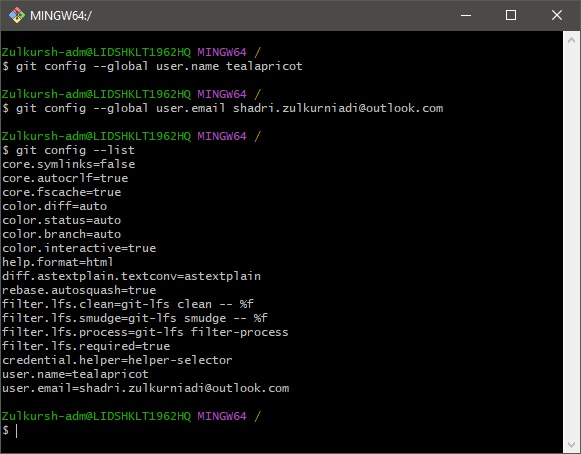
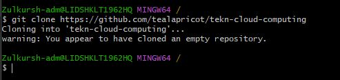
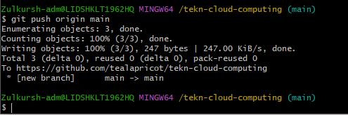
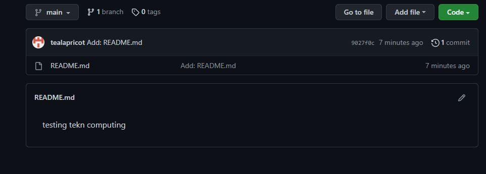

## Instalasi Git

silahkan masuk ke halaman https://git-scm.com/download/win untuk download lalu install

jika sudah terinstall bisa kita running bash dari gitu untuk mulai konfigurasi

## Konfigurasi Git

masukkan username dan email dengan kode berikut

> git config --global user.name tealapricot

> git config --global user.email shadri.zulkurniadi@outlook.com

kemudian kita cek list config yang sudah kita masukkan

> git config --list

## Create Repo

masuk ke halaman github untuk membuat repo baru, pastikan sudah login sesuai dengan username dan email yang sesuai dengan config

setelah ter-_create_ kita bisa clone repo ke device kita menggunakan _command_

> git clone https://github.com/tealapricot/tekn-cloud-computing

## Pengelolaan Repo

kemudian kita akan coba untuk push tanpa branching dan merging

> Zulkursh-adm@LIDSHKLT1962HQ MINGW64 /
> $ cd tekn-cloud-computing/
>
> Zulkursh-adm@LIDSHKLT1962HQ MINGW64 /tekn-cloud-computing (main)
> $ nano README.md
>
> Zulkursh-adm@LIDSHKLT1962HQ MINGW64 /tekn-cloud-computing (main)
> $ cat README.md
> testing tekn computing
>
> Zulkursh-adm@LIDSHKLT1962HQ MINGW64 /tekn-cloud-computing (main)
> $ git status
> On branch main
>
> No commits yet
>
> Untracked files:
> (use "git add <file>..." to include in what will be committed)
> README.md
>
> nothing added to commit but untracked files present (use "git add" to track)
>
> Zulkursh-adm@LIDSHKLT1962HQ MINGW64 /tekn-cloud-computing (main)
> $ git add -A
> warning: in the working copy of 'README.md', LF will be replaced by CRLF the next time Git touches it
>
> Zulkursh-adm@LIDSHKLT1962HQ MINGW64 /tekn-cloud-computing (main)
> $ git commit -m
> error: switch `m' requires a value
>
> Zulkursh-adm@LIDSHKLT1962HQ MINGW64 /tekn-cloud-computing (main)
> $ git commit -m "Add: README.md"
> [main (root-commit) 9027f0c] Add: README.md
> 1 file changed, 1 insertion(+)
> create mode 100644 README.md
>
> Zulkursh-adm@LIDSHKLT1962HQ MINGW64 /tekn-cloud-computing (main)
> $ git push origin main
> Enumerating objects: 3, done.
> Counting objects: 100% (3/3), done.
> Writing objects: 100% (3/3), 247 bytes | 247.00 KiB/s, done.
> Total 3 (delta 0), reused 0 (delta 0), pack-reused 0
> To https://github.com/tealapricot/tekn-cloud-computing
>
> - [new branch] main -> main

hasilnya akan menjadi seperti ini

## Sinkronisasi

kemudian untuk sinkronisasi repo lokal dengan ada yang di repo internet bisa menggunakan perintah

> git pull

