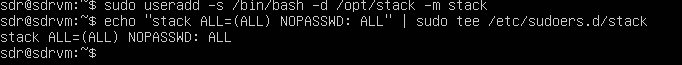
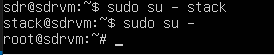
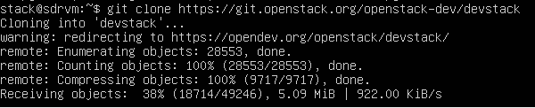
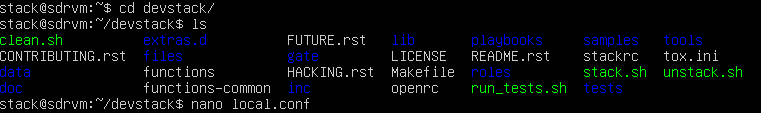
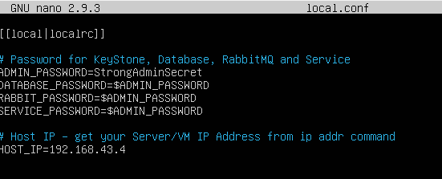
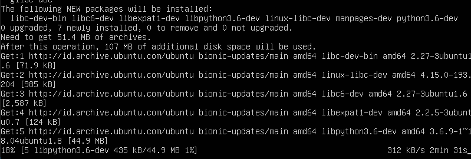
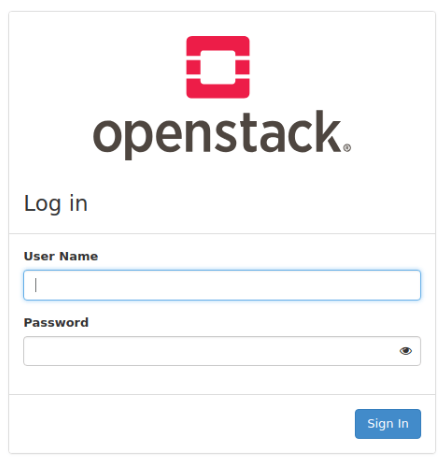
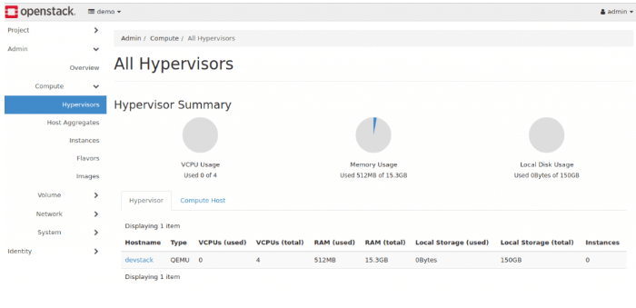

## Mendeploy Openstack menggunakan ubuntu 18.04 dan devstack

### Requirement
- Instalasi fresh ubuntu 18:04
- Minimal memory 4 GB
- Minimal 2 CPU
- Koneksi Internet

### Step 1 : Update Sistem Ubuntu
login ke sistem ubuntu dan dan update apt

lalu kemudian reboot

### Step 2 : Menambahkan user Stack
Devstack harus dijalankan menggunakan user selain root dan menggunakan sudo. maka perlu dibuat akun baru untuk mengeksekusi dan menjalankan devstack

lalu kemudian switch ke stack user untuk test

### Step 3 : Download Devstack

Download dari github dengan command berikut

Buat file local.conf dengan 4 password dan host IP address

### Step 4 : Start Openstack Deployment

setelah command dijalankan maka proses download dan instalasi akan dimulai

### Step 5 : Login ke Openstack Dashboard

Masuk ke IP server dan akses ke dashboard sesuai dengna ip yang telah terserdia

kemudian login dengan menggunakan user demo atau user admin

