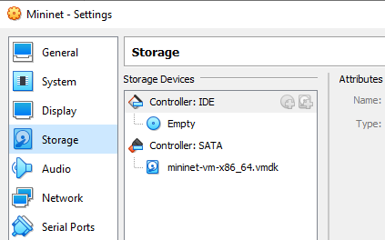
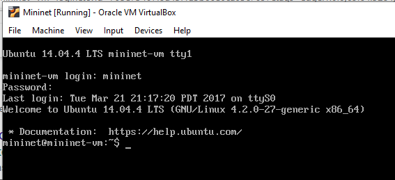
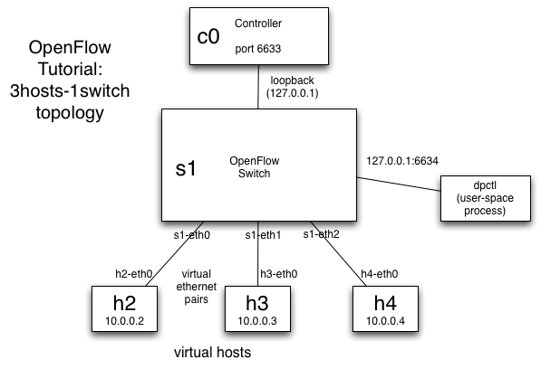
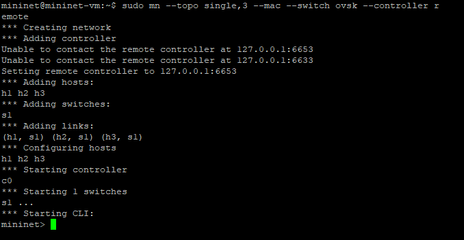
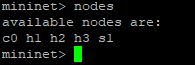
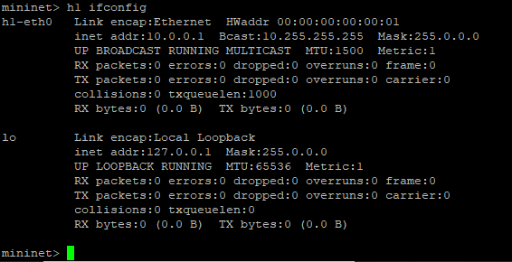
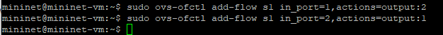
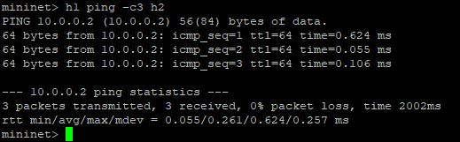

## Tutorial Openflow

### Step 1 : Download image ubuntu untuk openflow

bisa didownload disini https://github.com/mininet/openflow-tutorial/wiki/Installing-Required-Software

### Step 2 : Setup image di virtualbox

ekstrak filedownload dan create VM baru dengan disk yang sudah didownload

nyalakan VM dengan login user mininet password mininet 

### Tools Development

Memulai openflow network, contoh pertama adalah menggunakan topologi seperti digambar, dengan 3 host, 1 controller, dan 1 switch

Inilah yang baru saja dilakukan Mininet:

- Membuat 3 host virtual, masing-masing dengan alamat IP terpisah.
- Membuat satu switch perangkat lunak OpenFlow di kernel dengan 3 port.
- Menghubungkan setiap host virtual ke switch dengan kabel ethernet virtual.
- Atur alamat MAC setiap host sama dengan IP-nya.
- Konfigurasikan OpenFlow switch untuk terhubung ke pengontrol jarak jauh.

#### beberapa command dalam mininet

- melihat node yang aktif 

- mengecek ip tiap host

- menghubungkan 2 nodes menggunakan flows

jika kita test ping telah bisa reply berarti 2 host sudah terhubung

