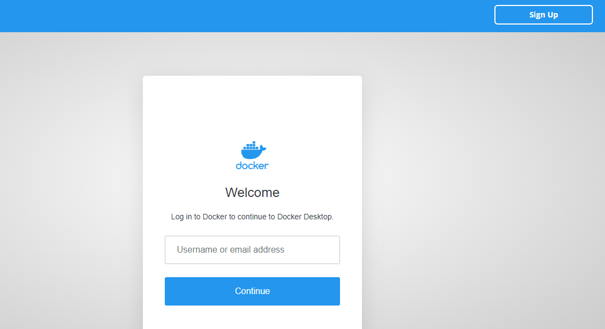
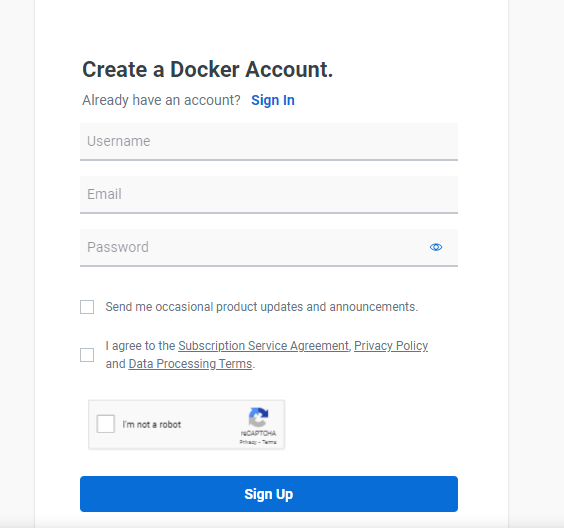
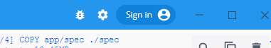
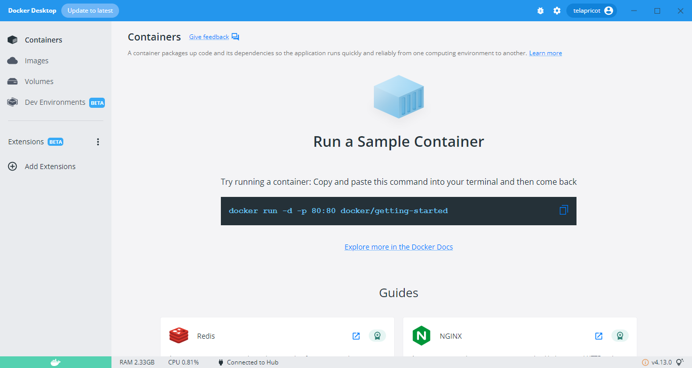
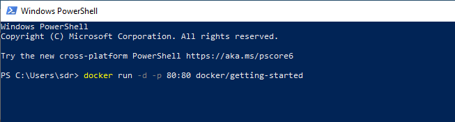
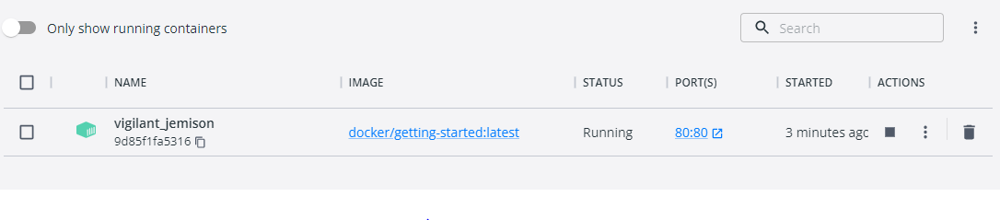
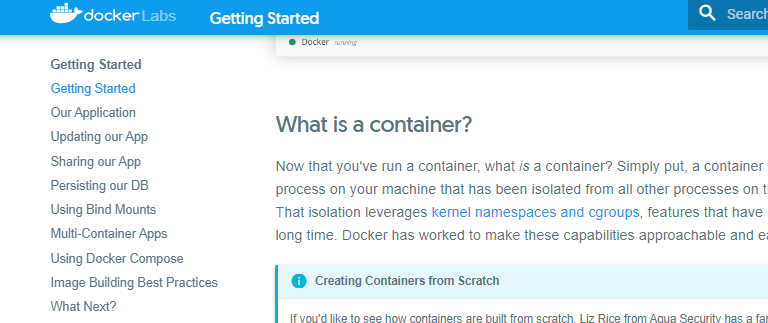

## Getting Started Docker

Pertama-tama silahkan daftar akun docker untuk dapat menggunakan docker

https://login.docker.com/
lalu klik sign up

Masukkan email dan password lalu klik Sign Up

kemudian setelah selesai melakukan registrasi, akun tersebut bisa digunakan untuk login di docker desktop di tombol sign in kanan atas

Berikut tampilan docker desktop

semua container yang telah dijalankan akan muncul disini.

### Membuat container

buka terminal lalu masukkan perintah berikut
docker run -d -p 80:80 docker/getting-started
lalu jalankan di terminal

setelah dijalankan kita coba cek di docker desktop, apakah sudah runnung container yang sudah kita jalankan tadi

jikas sudah running maka kita buka web dengan alamat http://localhost:80

jika muncul seperti ini berarti container sudah sukses dijalankan