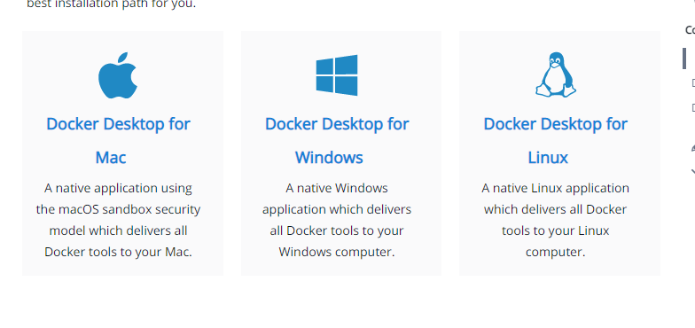
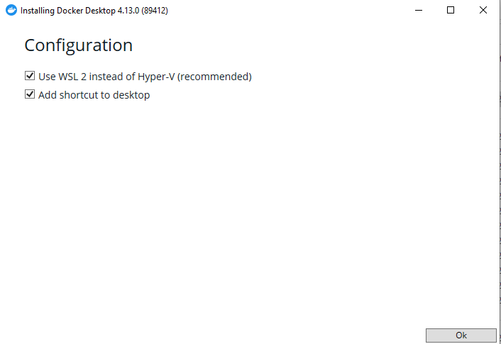
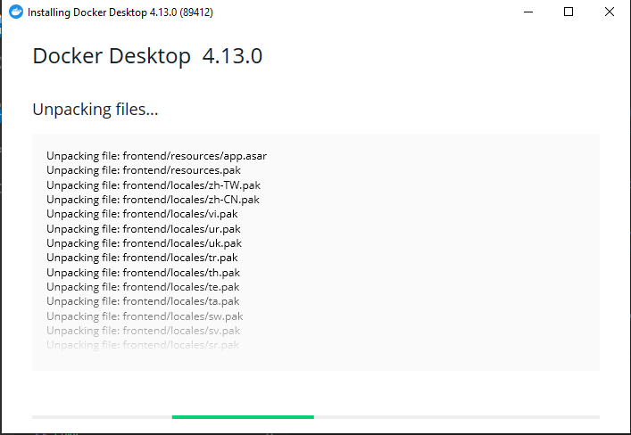
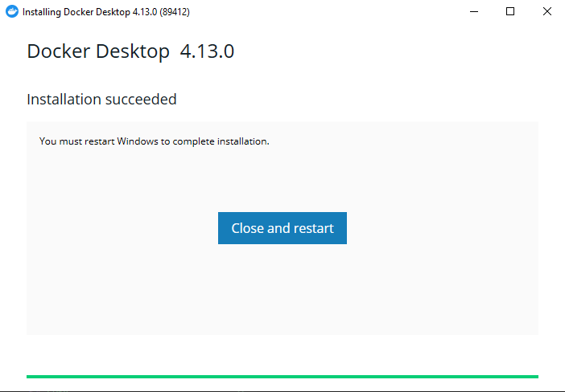
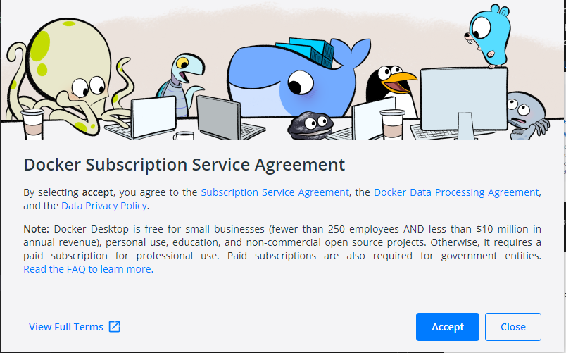

## Instalasi Docker

masuk ke laman download docker lalu pilih instalasi docker yang akan kita pilih, karena penulis menggunakan windows maka kita pilih docker windows

https://docs.docker.com/get-docker/

Kemudian setelah sukses download kita buka installernya, dan akan ada pilihan options

silahkan centang keduanya, dan terutama nomor satu karena akan sangat membantu performa docker itu sendiri, lalu klik ok

Jika instalasi sudah selesai tekan restart

Setelah sukses restart akan muncul EULA agreement, jika setuju klik accept