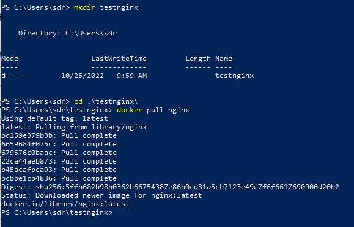
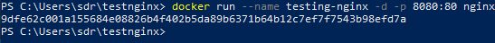
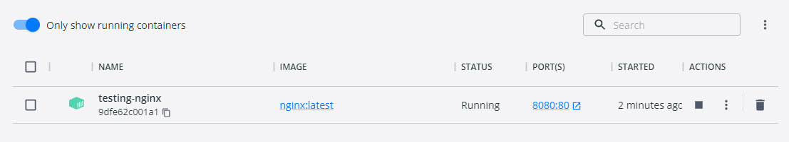
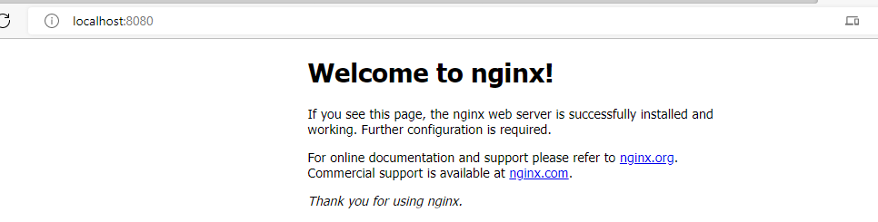

## Instalasi image docker Nginx

buka terminal dan buat direktori untuk nginx

kemudian kita running perintah untuk membuat container baru dan expose port ke 8080
docker run --name testing-nginx -d -p 8080:80 nginx

lalu coba kita cek di docker desktop

lalu jika sudah benar-benar suksek running maka kita buka browser dengan alamat
http://localhost:8080/

Nginx sukses running