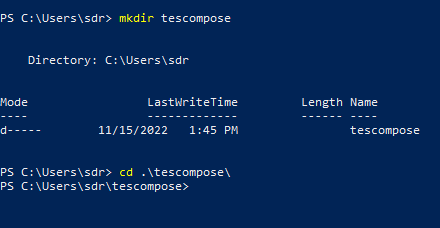
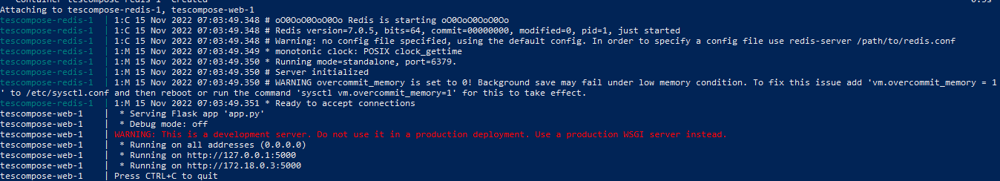
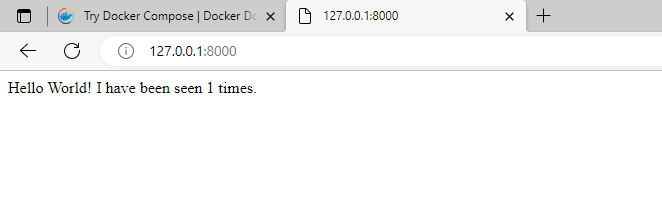
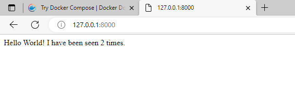
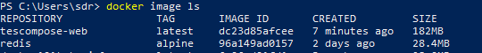
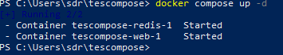

# Mencoba Docker Compose

## Persyaratan
- Terinstall docker engine dan docker compose
- Atau, Docker desktop yang telah terinstall

## Membuat dependensi

buat direktori baru untuk sebagai folder direktori dependensi


buat file `app.py` di folder tersebut dan isikan dengan kode berikut

```
import time

import redis
from flask import Flask

app = Flask(__name__)
cache = redis.Redis(host='redis', port=6379)

def get_hit_count():
    retries = 5
    while True:
        try:
            return cache.incr('hits')
        except redis.exceptions.ConnectionError as exc:
            if retries == 0:
                raise exc
            retries -= 1
            time.sleep(0.5)

@app.route('/')
def hello():
    count = get_hit_count()
    return 'Hello World! I have been seen {} times.\n'.format(count)

```

kemudian buat file bernama `requirements.txt` berisi berikut

```
flask
redis
```

## Membuat dockerfile

docker file digunakan untuk membuat docker image yang berisi semua dependensi yang dibutuhkan oleh python.
buat file bernama `dockerfile` menggunakan kode berikut

```
# syntax=docker/dockerfile:1
FROM python:3.7-alpine
WORKDIR /code
ENV FLASK_APP=app.py
ENV FLASK_RUN_HOST=0.0.0.0
RUN apk add --no-cache gcc musl-dev linux-headers
COPY requirements.txt requirements.txt
RUN pip install -r requirements.txt
EXPOSE 5000
COPY . .
CMD ["flask", "run"]
```

## Mendefinisikan Services pada file compose

buat file bernama `docker-compose.yml` pada direktori proyek anda denan berisi kode

```
version: "3.9"
services:
  web:
    build: .
    ports:
      - "8000:5000"
  redis:
    image: "redis:alpine"

```

service akan membuka dua services yaitu web dan port untuk redis

## Menjalankan aplikasi menggunakan compose

dari direktori yang sudah kita buat tadi running menggunakan command `docker compose up`


jika sudah selesai seperti diatas maka bisa dicoba untuk akses web ke `http://127.0.0.1`
dan jika sukses akan muncul seperti ini

coba kita reload dan akan berubah countingan tersebut


kemudian coba buka terminal baru dan jalankan perintah `docker image ls`
maka jika compose berjalan semestinya akan muncul dibawah


kemudian hentikan aplikasi dengan menggunakan `docker compose down` atau dengan menekan tombol ctrl+c pada terminal kita menjalankan compose tadi

## Menambahkan bind mount

edit file `docker-compose.yml` tadi dengan kode berikut

```
version: "3.9"
services:
  web:
    build: .
    ports:
      - "8000:5000"
    volumes:
      - .:/code
    environment:
      FLASK_DEBUG: True
  redis:
    image: "redis:alpine"
```
Volume tersimpan pada folder code dalam project directory, jadi semisal kita ingin mengubah code bisa dilakukan secara cepat

## Menjalankan ulang docker compose

jalankan ulang dengan menggunakan `docker compose up -d` untuk menjalankan docker dari background



