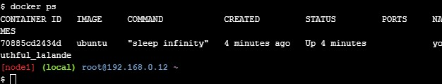

# Docker Orchestration

## Inisiasi Docker Orchestration

jalankan image ubuntu di node 1 dengan command

`docker run -dt ubuntu sleep infinity`

Command diatas akan menjalankan container image ubuntu:latest dan akan running secara sleep agar container akan berjalan di background, bisa kita cek container yang berjalan dengan perintah
`docker ps` pada node 1

## Menjalankan node manager

untuk menjalankan swarm baru bisa menggunakan perintah

`docker swarm init --advertise-addr $(hostname -i)`

kemudian untuk menghubungkan node lainnya agar bisa terhubung dengan swarm, kita kopikan token yang telah kita generate tadi di node 1 dan kita jalankan di node 2 dan node 3

jika sudah kita kembali lagi ke node 1 dan jalankan perintah

`docker node ls`

untuk mengecek apakah node 2 dan node 3 telah sukses menjadi node worker

## Mendeploy aplikasi ke swarm

kita pindah ke node 1 dan jalankan service ubuntu dengan perintah

`docker service create --name sleep-app ubuntu sleep infinity`

kemudian kita verifikasi apakah node sudah terinstall dengan menggunakan perintah

`docker service ls`

## Scale aplikasi

untuk scaling aplikasi jika penggunaan bertambah kita dapat melakukan replika dengan menggunakan command

di skenario ini kita akan mereplika sebanyak 7 buah

`docker service update --replicas 7 sleep-app`

kemudian kita cek lagi apakah proses replika berjalan dengan semestinya

`docker service ps sleep-app`

sudah ada 7 replika yang berjalan

## Drain node

drain node digunakan untuk kita menghilangkan service yang berjalan pada suatu notr sehingga kita dapat melakukan maintenance pada node tersebut

untuk melakukan drain node kita menggunakan perintah

`docker node update --availability drain yournodeid`

kita tes untuk drain node 2 seperti digambar

statusnya sudah drain maka tidak ada servicce yang berjalan di node 2 maka kita bisa lakukan maintenance
