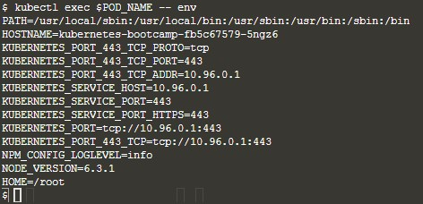

# Learn Kubernetes Basic

## Create Cluster

### Cek versi minikube

karena kita akan menggunakan minikube untuk mendeploy kubernetes, cek apakah minikube telah terinstall atau belum

### Menjalankan minikube

jika sudah terinstall maka jalankan vminikube tersebut dengan perintah

`minikube start`

### Cek versi cluster

cek apakah kubectl sudah terinstall ataukah belum dengan perintah
`kubectl version`

### Cek detail cluster

untuk mengecek cluster detail gunakan perintah
`kubectl cluster-info`

### Mengecek node yang tersedia

untuk mengecek node yang tersedia di cluster dapat menggunakan perintah `kubectl getnodes`

saat ini kita memiliki 1 node dan kita lihat terdapat statusnya adalah ready

## Mendeploy Aplikasi

setelah diatas kita mengerti bagaimana cara membuat cluster maka sekarang kita akan belajar cara menggunakan kubernetes untuk mendeploy aplikasi

dengan perintah `kubectl create deployment` maka kita akan melakukan deployment yang dibarengi dengan nama dan lokasi image. contohnya seperti dibawah

### membuat deployment

`kubectl create deployment kubernetes-bootcamp --image=gcr.io/google-samples/kubernetes-bootcamp:v1`

jika sudah sukses berjalan maka kubectl akan mencari node yang available dan mengassign aplikasi ini di node tersebut

### Mengecek deployment yang berjalan

gunakan perintah ini untuk mengecek deployment yang telah berjalan `kubectl get deployments`

kita bisa lihat aplikasi sudah terdeploy ke node yang tersedia

### Enable proxy

secara default kubernetes berjalan privat dan terisolasi dari jaringan luar, jadi tiap pods dapat mengakses satu sama lainnya namun tidak demikian untuk akses keluar dan masuk

maka untuk melakukan enable akses dari luar bisa menggunakan command berikut

`echo -e "\n\n\n\e[92mStarting Proxy. After starting it will not output a response. Please click the first Terminal Tab\n"; 
kubectl proxy`

## Eksplorasi Apps yang telah kita buat

### Cek pods yang berjalan pada node

sekarang kita cek apakah pods yang telah deploy tadi telah berjalan dengan perintah

`kubectl get pods`

kita lihat sudah terdapat 1 pods yang berjalan

### Mengecek container didalam pods

untuk melihat apa saja yang ada didalam pod yang telah berjalan kita bisa gunakan perintah `kubecctl describe pods`

### Cek container logs

untuk mengecek log dari container kita bisa menggunakan command

`kubectl logs $namapod`

### Menjalankan perintah ke spesifik pods

untuk menjalankan perintah ke pods tertentu kita bisa menggunakan perintah exec seperti contoh dibawah untuk mengecek environment dari pods tersebut

`kubectl exec $POD_NAME -- env`

sekarang kita buka perintah bash ke pods yang kita miliki dengan perintah
`kubectl exec -ti $POD_NAME -- bash`

kemudian kita coba untuk modifikasi file didalam pods, sekarang kita coba modifikasi file server.js

`cat server.js`

kemudian jika kita ingin keluar dari bash gunakan command

`exit`
